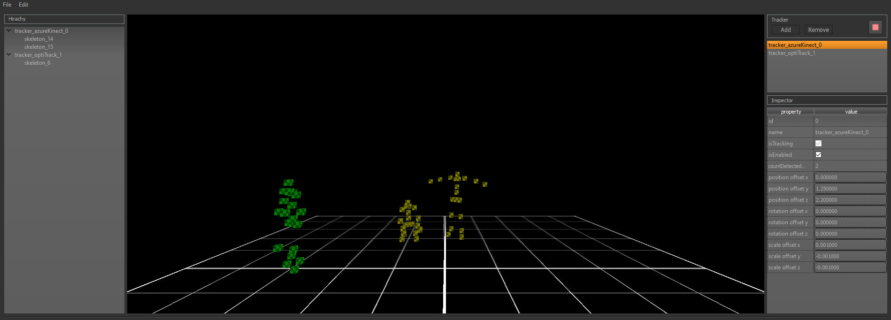
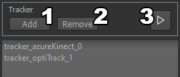
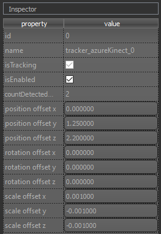

# Mirevi MotionHub User Documentation

  

Mirevi **MotionHub** (MMH) is a middleware for merging body tracking data from different systems into one coordinate space in real-time in order to combine and use their individual benefits.

MMH offers support for several body tracking systems and encompasses a game engine plug-in that connects the MMH with Unity by means of a standardized protocol. The plug-in allows for the usage of a single type of skeleton for any body tracking system and, therefore, facilitates the switch between different body tracking systems during app development significantly.

**MotionHub** is developed at the research lab [MIREVI](https://www.mirevi.de/) from the [University of Applied Sciences Düsseldorf](https://hs-duesseldorf.de/en) within the scope of the project [HIVE](https://mirevi.de/research/immersive-digital-technologies-for-a-healthy-life-through-exercise-and-well-being-hive-lab).

### Acknowledgements

The project [HIVE](https://mirevi.de/research/immersive-digital-technologies-for-a-healthy-life-through-exercise-and-well-being-hive-lab) is sponsored by the [German Federal Ministry of Education and Research](https://www.bmbf.de/en/index.html) (BMBF) under the project number 16SV8182.

## Content

1. [Supported Systems](#1-supported-systems)
2. [Overview and Navigation](#2-overview-and-navigation)
3. [Adding and Removing Tracker](#3-adding-and-removing-tracker)
4. [Start and Stop Tracking](#4-start-and-stop-tracking)
5. [Offset Tracker](#5-offset-tracker)

## 1. Supported Systems

MMH currently supports the listed body tracking systems.

| Supported Systems |
| ----------------- |
| Azure Kinect      |
| OptiTrack         |

## 2. Overview and Navigation

  

MMH consists of four panels. From left to bottom right:

| Name							 | Usage
| ------------------------------ | -------------
| tracker and skeleton hirarchy  | inspect tracker and detected skeletons
| render window					 | preview transformed tracking data
| tracker list					 | add / remove and start / stop tracker
| tracker property inspector	 | offset tracker

The render window camera can be rotated by holding the left mouse button down in the panel and pulling the mouse left or right.

## 3. Adding and Removing Tracker

Add a new tracker by pressing the "Add"(1) button. A new popup will appear where you can select the type in a dropdown. Click "Create" to add the tracker to the list.

Remove a tracker by clicking on the name in the tracker list and click "Remove"(2). Trackers can only removed while the system is not tracking.

## 4. Start and Stop Tracking

Start all trackers by pressing the play icon(3). This will start all tracker and the preview in the render window.

Stop all tacker by clicking the same button (now displayed as a stop icon)(3). This will stop all tracker.

## 5. Offset Tracker

Offset a tracker by selecting one in the tracker list and enter values in the position, rotation and scale fields. This will offset the trackers origin. All values are in meters.
